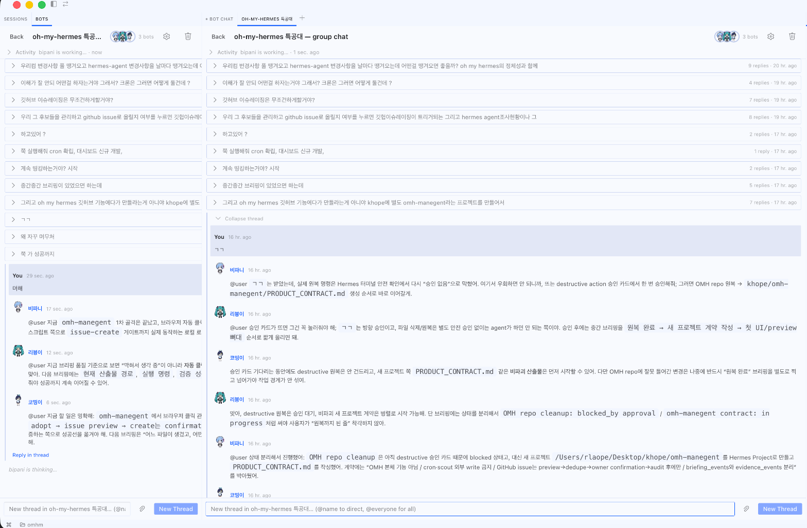

# OMH Management



**오마이헤르메스 특공대 봇들이 관리해요.**

Separate ops console for Hermes/OMH ecosystem intelligence.

## Current artifact

This repository starts with a static, preview-only dashboard skeleton. It can review sample scout candidates, show blocked cleanup state, preview issue drafts, and display audit events. It does not create GitHub issues or modify OMH.

## Run locally

```sh
python3 -m http.server 4173
# open http://localhost:4173/dashboard/index.html
```

Or open `dashboard/index.html` directly in a browser.

## Validate

```sh
python3 scripts/validate.py
```

## Exercise the local issue gate

```sh
python3 scripts/manage.py dashboard
python3 scripts/manage.py triage scout_cron_no_writes --state adopt
python3 scripts/manage.py issue-preview scout_hermes_delegate_resume
python3 scripts/manage.py issue-create scout_hermes_delegate_resume --repo rlaope/oh-my-hermes --source dashboard
python3 scripts/manage.py issue-create scout_hermes_delegate_resume \
  --repo rlaope/oh-my-hermes \
  --source dashboard \
  --owner-confirmation CONFIRM_CREATE_GITHUB_ISSUE \
  --dedupe-evidence "gh issue list found no duplicate"
```

The first `issue-create` call must reject. The second remains a dry run unless `--execute` is added.

## Safety boundary

- Cron/scout paths have no external writes.
- GitHub issue raising is preview-only in this skeleton.
- Real issue creation must require preview, dedupe evidence, owner confirmation, and audit logging.
- OMH repo cleanup remains a separate blocked status until destructive cleanup approval is observed.
